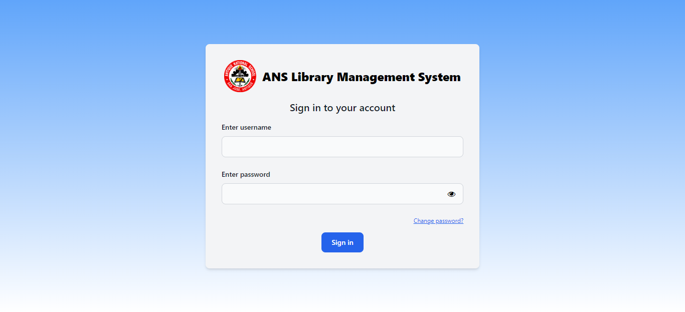

<h1 align="center">Hi 👋, I'm Rieza Marie J. Banquillo</h1>

    

    

<h3 align="center"> A passionate front-end developer from Antique, Philippines.</h3>

#

<h3>📩 Connect with me through :
    
    
</h3>
<h3>📫 E-mail me at
    <a>rizmarezlo@gmail.com</a>
</h3>

#

**<h2>📁 Projects</h2>**

    

        <a href="https://github.com/Stacktrek-Training/stack-sched" target="_blank"><h3>StackSched : Scheduling System for Part-timers</h3></a>
        
    

    

        <a margin-top="50%" href="https://github.com/rieza-ix/library-management-system" target="_blank"><h3>ANS LMS: ANS Library Management System</h3></a>
        
    

#

**<h2>💻 Languages</h2>**

    
    
    
    
    
    

#

**<h2>💻 Tools</h2>**

    
    
    

#

**<h2>📈 Statistics</h2>**

